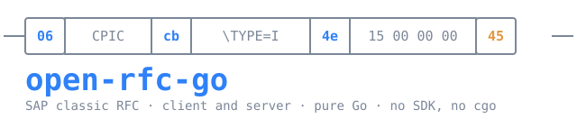

```
 ─┬──┬────────┬──┬──────────┬──┬──────────┬──┬─
  │06│  CPIC  │cb│ \TYPE=I  │4e│ 15000000 │45│
 ─┴──┴────────┴──┴──────────┴──┴──────────┴──┴─
```

A pure-Go, **SDK-free** implementation of SAP classic synchronous RFC — client
**and** server. No NW RFC SDK, no native library, no cgo. A Go port of
[`open-rfc`](https://github.com/marianfoo/open-rfc).

*(That frame above is real: an `INT4` parameter carrying 21, as the fast
serializer writes it. We took it off the wire — see
[serializer selection](docs/discoveries/serializer-selection.md).)*

> ## 🎉 The fast serializer is decoded — records, types, and the compression
>
> **2026-08-23 — SAP's fast RFC serialization is no longer opaque.** The record
> grammar is tag-dependent and now read: `char`, `INT4`, `STRING` and the padded
> forms, each with its own framing. Behind a `\TYPE=` descriptor sits a
> **field-description list** whose single-byte **DDIC type codes** are
> cross-checked field for field against the live system — including the detail
> that trips a decoder in half: **`CHAR` widths count UTF-16 units while `RAW`
> counts bytes**, so `CHAR(50)` travels as 100 and `RAW(3)` as 3. `0x5001` turned
> out not to be a container at all but one id of an item grammar that closes with
> a repeat of its own tag. And payloads above 512 bytes are **LZ4** — the
> published block format, verified against every compressed block in our captures,
> each located by the eight-byte header that declares both sizes. Structures only
> ever travel compressed here, so the type table came out of a frame that was
> unreadable the day before. → [`serializer-selection.md`](docs/discoveries/serializer-selection.md)

> **Before that** — 
> [**2026-08-22** · all four serializers selectable, and what each puts on the wire](BANNERS.md#2026-08-22-the-serializers-mapped-and-the-fast-one-decoded) · 
> [**2026-08-20** · call any function module, and expose it to an assistant as MCP tools](BANNERS.md#2026-08-20-call-any-sap-function-module-from-go-the-shell-or-as-mcp-tools) · 
> [**2026-08-19** · both directions live against real SAP, zero SAP libraries](BANNERS.md#2026-08-19-both-directions-live-against-real-sap-with-zero-sap-libraries) · 
> every headline this project has run: [`BANNERS.md`](BANNERS.md)

> ⚠️ **Research preview — `v0.2.0`.** A tagged preview, not a stable API: `0.x`
> means it may move under you, and there is no support boundary. Classic
> RFC has no transport encryption — don't send credentials across an untrusted
> network ([`SECURITY.md`](SECURITY.md)). Don't depend on it yet.

## What you can do now

### Hand a live SAP system to an assistant — `orfc mcp`

The bridge is one binary and one line of config. `orfc mcp` speaks the Model
Context Protocol over stdio, and every function module you admit becomes a real
tool, its `inputSchema` generated from the module's own interface:

```sh
orfc mcp --read-only --expose 'STFC_*' --hide '*_BACK,*_TCPIC,*_SAPGUI'
```

**A green list you wrote beats a red list you hoped was complete.** That command,
run against a live A4H, admits exactly this — 18 `STFC_*` modules exist, the red
list removes four, and `--read-only` withholds the generic `call` that would
otherwise be a way around the whole arrangement:

```
generic:  rfc_info  rfc_ping  rfc_describe  rfc_search  rfc_read_table
          (rfc_call appears only without --read-only)

per-FM :  STFC_STRING          STFC_XSTRING         STFC_DEEP_STRUCTURE
          STFC_DEEP_TABLE      STFC_EXCEPTION       STFC_CHANGING
          STFC_CHANGING_TABLE  STFC_CONNECTION      STFC_PERFORMANCE
          STFC_STRUCTURE       STFC_TX_TEST         STFC_RETURN_DATA
          STFC_RETURN_DATA_INTERFACE               STFC_START_CONNECT_REG_SERVER

withheld by the red list:
          STFC_CONNECTION_BACK  STFC_WRITE_TO_TCPIC  STFC_QRFC_TCPIC  STFC_SAPGUI
```

| flag | effect |
|---|---|
| `--read-only` | no writes at all — and no generic `rfc_call` |
| `--safe` | blocks modules whose names read as mutating, and `BAPI_TRANSACTION_COMMIT` |
| `--allow-commit` | permits that commit again inside `--safe`, when you mean it |
| `--expose 'MASK,…'` | green list — only matching modules become tools |
| `--hide 'MASK,…'` | red list, subtracted from the green list |
| `--max N` | cap how many tools are generated |

Wiring it into Claude Code, Codex or any MCP client is a `.mcp.json` entry:

```json
{ "mcpServers": { "a4h": {
    "command": "/abs/path/to/orfc",
    "args": ["mcp", "--read-only", "--expose", "STFC_*"],
    "env": { "SAP_ASHOST": "a4h.example", "SAP_SYSNR": "00",
             "SAP_CLIENT": "001", "SAP_USER": "DEVELOPER", "SAP_PASSWORD": "…" }
} } }
```

### The same thing from a shell — `orfc`

One binary, two modes. Everything the assistant can do, you can do by hand:

```sh
export SAP_ASHOST=a4h.example SAP_SYSNR=00 SAP_CLIENT=001 \
       SAP_USER=DEVELOPER SAP_PASSWORD='…'      # or a .rfc.json system

orfc ping
orfc info                                        # RFC_SYSTEM_INFO
orfc call STFC_CONNECTION '{"REQUTEXT":"hi"}'    # any FM, from plain JSON
orfc describe STFC_STRUCTURE                     # the interface, as a JSON Schema
orfc search 'BAPI_USER_*'                        # what is RFC-enabled here
orfc read-table T000 --top 5
```

`orfc info` against a stock A4H answers with the system talking about itself:

```json
{
  "RFCSYSID":  "A4H",      "RFCSAPRL":   "758",       "RFCKERNRL": "793",
  "RFCHOST":   "vhcala4h", "RFCDBSYS":   "HDB",       "RFCOPSYS":  "Linux",
  "RFCCHARTYP":"4103",     "RFCINTTYP":  "LIT",       "RFCPROTO":  "011"
}
```

`4103` is the code page (UTF-16LE), `LIT` little-endian, `011` the RFC protocol
version — the three fields every decoder in this repository has to agree with.

Full setup, and the errors you will actually hit:
[**`docs/quickstart-a4h.md`**](docs/quickstart-a4h.md).

### See the protocol — `orfc-lab`, `orfc-viewer`

`orfc-lab` runs a transparent sniffer and a generating ("conscious") server
together; point SM59 type-3 destinations at this box, then
decode captures offline with `orfc-viewer`:

```sh
go run ./cmd/orfc-lab -target-host <your-real-sap-host>
#   ports 3200/3300   sniffer → the real system, captures the wire (-dump cap-lab.jsonl)
#   port  3313        conscious server (sys 13) — generates classic responses (Serializer=Classic)
go run ./cmd/orfc-viewer cap-lab.jsonl                # decoded text transcript (values redacted)
go run ./cmd/orfc-viewer -html cap-lab.jsonl         # writes cap-lab.html — a self-contained visual inspector
go run ./cmd/orfc-viewer -serve :8080 cap-lab.jsonl  # HTTP inspector at localhost:8080 (refresh reloads a growing dump)
```

`orfc-viewer` is offline — it reads a capture file, never a live SAP system;
`-values` includes decoded scalar/table values (may reveal credentials/data).

### Answer the calls yourself — `orfc-srv`

`orfc-srv` is the server front door, in either role a destination can address.
Point an SM59 destination at it and every `CALL FUNCTION … DESTINATION` lands in
the dispatcher — which is how you exercise a Z function module against this
implementation without a second SAP system:

```sh
go run ./cmd/orfc-srv -mode typet -listen :3300     # registered server (SM59 type T)
go run ./cmd/orfc-srv -mode type3 -listen :3313     # an ABAP system    (SM59 type 3)
# answers Z_DOUBLE, Z_GREET, STFC_CONNECTION, RFC_PING; anything else raises FU_NOT_FOUND
```

### Use it as a library

Native Go values in and out, an FM interface resolved and cached for you, and an
ABAP-side failure returned as a typed error:

```go
ctx := context.Background()
c, _ := rfc.Open(ctx, rfc.Destination{
    Host: "sap.example", Port: 3300, // gateway of instance 00
    Client: "001", User: "DEVELOPER", Password: "…", Language: "E",
})
defer c.Close(ctx)

res, err := c.Call(ctx, "STFC_CONNECTION", rfc.Params{"REQUTEXT": "hello from Go"})
// res.Get("ECHOTEXT"), res.Table("RFCTABLE"), …
var ex *rfc.ABAPException
if errors.As(err, &ex) { /* typed ABAP-side failure */ }
```

The public surface is deliberately small, and it is not hypothetical: it is what
[vibing-steampunk](https://github.com/oisee/vibing-steampunk) builds its RFC leg
on — `vsp rfc` and `vsp rfc debug` are this package, and the ABAP debugger below
is driven through it. A library that one real tool depends on is a library that
has had its corners knocked off.

### Debug ABAP over RFC

A pinned conversation is a stable ABAP session, which
is exactly what the debugger needs: `attach_debuggee( )` hands back an object
reference and every later operation hangs off it. So `Client.Pin` plus a thin
ABAP facade gives real breakpoints, attach, and stepping — no SAP GUI, no
Eclipse, no WebSocket:

```go
session, _ := c.Pin(ctx)      // one connection, one roll area, held open
defer session.Close()
session.Call(ctx, "ZADT_DEBUG_RFC", rfc.Params{"I_OP": "listen", "I_TIMEOUT": 120})
session.Call(ctx, "ZADT_DEBUG_RFC", rfc.Params{"I_OP": "attach", "I_DEBUGGEE_ID": id})
session.Call(ctx, "ZADT_DEBUG_RFC", rfc.Params{"I_OP": "step", "I_KIND": "over"})
```

Live on A4H: a breakpoint set from one connection, hit by a function module
called over a *second* connection, attached to, and stepped through — with the
stack showing the real RFC entry chain `%_RFC_START` → `REMOTE_FUNCTION_CALL` →
the module.

**And it needs nothing installed on the server.** SAP's own ADT debugger
resources — the ones Eclipse drives — reach the same place through
`SADT_REST_RFC_ENDPOINT` on a pinned conversation:

```
POST /sap/bc/adt/debugger/listeners?debuggingMode=user&requestUser=…   → the debuggee that stopped
POST /sap/bc/adt/debugger?method=attach&debuggeeId=…                   → attached
GET  /sap/bc/adt/debugger/stack?method=getStack                        → dbg:stack, source URIs and all
POST /sap/bc/adt/debugger?method=stepOver                              → dbg:step
```

A stateless HTTP client cannot use these, because ADT keeps the debug session in
an ABAP roll area and can only find it again through a `sap-contextid` cookie.
Over RFC the roll area *is* the conversation, so there is nothing to correlate —
and the answers come back with everything ADT knows: per-frame source URIs, DYNP
screen frames, authorization flags, the action catalogue. SAP itself labels the
session `RFC session: <instance>`.

Driver and the typed ABAP facade:
[vibing-steampunk](https://github.com/oisee/vibing-steampunk) (`vsp rfc debug`).
Two paths, and you can switch between them: SAP's own ADT resources with nothing
installed, or a small function group of your own. This is a research project —
what you run against which system is your call.
Full write-up: [`reports/debugger-over-rfc.md`](reports/debugger-over-rfc.md).

**The debugger is only the hard case.** `SADT_REST_RFC_ENDPOINT` carries an
arbitrary HTTP request, so *any* ADT resource is reachable the same way — source
read and write, activation, ATC, unit tests, transports, search, refactoring:
the whole surface, over the gateway port, where ICF is closed, HTTPS terminates
somewhere inconvenient, or CSRF and cookies are a fight. Proven so far:
`discovery` (200, 299 KB), program source (200 with `ETag`/`Last-Modified`), a
missing object (404 with ADT's own exception document), and the debugger's
listen/attach/stack/step.

The stateful half is proven too: `LOCK` → `PUT` → `UNLOCK` → `ACTIVATE`, four
separate HTTP requests on one pinned conversation, and the lock handle from the
first still valid in the second. Over HTTP that fails — a short-lived client
cannot hold the ABAP session a lock is bound to. The object used for the test
was one an HTTP client could not even lock (`MODIFICATION_SUPPORT=NoModification`,
which is SAP saying "no modification assistant needed", not "read-only"). So
writing ABAP over RFC is not merely equivalent to writing over HTTP — on that
system it is strictly more capable.

## Status

| | state |
|---|---|
| **Client** | live-proven against A4H — `rfc.Open` / `Client.Call`, metadata cache, typed ABAP errors. Scalars (incl. STRING/XSTRING, DATE/TIME, packed DEC, FLOAT), flat **and deep** structures & tables (STRING/XSTRING via xRFC), classic **and** fast-serialization responses |
| **Server** | answers all SM59 test buttons + a real program (via captured, token-patched replies); a generating "conscious" server is WIP |
| **Decode** | S/4HANA classic responses decode fully — scalars + tables (native & mixed) |
| **Tooling** | live: a `orfc` CLI (`info`/`describe`/`search`/`call`/`read-table`/`ping`) and an MCP server (`orfc mcp`, stdio) — `describe <FM>` emits an MCP-tool JSON Schema, generic `call` runs any FM (JSON args, coerced per interface), and **`--expose`/`--hide` masks auto-generate real per-FM MCP tools** (with `outputSchema` + read-only/destructive hints; `--safe` blocks write FMs). Config via `.rfc.json` + env + flags. Dependency-free, extractable subproject |
| **Debugger** | ✅ the ABAP debugger driven end to end over classic RFC on a pinned session (`Client.Pin`) — **including SAP's own ADT debugger resources, with nothing installed on the server**: listen, attach, step, stack, live-verified against A4H |
| **Callback** | ✅ server→client RFC callbacks (DESTINATION 'BACK') — register `Destination.Callbacks`; live-verified |
| **Serialization** | all four modes selectable on demand. The **fast serializer is decoded**: record grammar, field lists with DDIC-verified type codes, the item grammar, and LZ4 above 512 bytes located by its size header. Decode only — we do not yet produce fast |
| **Next** | per-FM `outputSchema` + HTTP transport for `orfc mcp`; write-FM safety gate ([design](docs/design/write-fm-safety.md)); finish the generating server |

Full history: [`CHANGELOG.md`](CHANGELOG.md); the ranked plan: [`docs/roadmap.md`](docs/roadmap.md).

## Learn more

| Document | For |
|---|---|
| [**Quickstart — against an A4H system**](docs/quickstart-a4h.md) | **start here**: ports, a user that works, first calls, MCP config, access lists, what goes wrong |
| [**About** — what it is & how it's built](docs/about.md) | rationale, porting discipline, scope, cross-language hazards |
| [Discoveries 0001 — live type-3 server](docs/discoveries/0001-live-type3-server.md) | the whole server wire journey |
| [Cheat sheet](docs/cheatsheet.md) | ports, auth, constants, commands — one page |
| [Docs index](docs/README.md) | everything else (primer, glossary, architecture, dev) |
| [Porting plan](docs/porting-plan.md) | what's next and why in that order |
| [Serializer selection](docs/discoveries/serializer-selection.md) | how the serializer is chosen and what each one puts on the wire |
| [Role state machines](docs/role-state-machines.md) | who may send what, when — and the keepalive rule |
| [Roadmap](docs/roadmap.md) | ranked plan — what's done, the tool surface, callbacks, and later bets |

## How this differs from `open-rfc`

`open-rfc` is the TypeScript original, and it is the reason this exists: it
established that classic RFC can be spoken without SAP's SDK, and it did the
hard, unglamorous work of getting the framing right. Roughly a third of this
repository is a line-by-line port of it, recorded file by file in
[`docs/provenance.md`](docs/provenance.md) as Apache-2.0 §4(b) requires.

**Ported from `open-rfc`** — NI framing, the checked byte reader/writer, RFCPRO
field headers, the gateway record, APPC records and fragmentation, the password
scramble (bit-exact, verified against a frozen SHA-256 over 21,592 vectors), the
RFC error envelope, and the CPIC layer with its bounded initial-logon grammar.

**Written here, clean-room from our own captures** — the fast serialization
codec, the entire server side (seven roles, from replay to a dispatching
"conscious" server), xRFC and the recursive metadata graph, server→client
callbacks, pinned sessions, the ABAP debugger over RFC, and the ADT tunnel.

**What the translation changed, deliberately:**

| `open-rfc` | here |
|---|---|
| thrown `RangeError`/`Error` | returned, wrapped sentinel errors (`errors.Is`/`As`) |
| Promise/AbortSignal orchestration | a blocking transport plus `context.Context` |
| an `RfcFailure` taxonomy | one documented error tree on the public `rfc` package |
| runtime type guards | Go's fixed-width parameter types, checked at compile time |
| typed-array geometry intrinsics | dropped — that attack class does not exist in Go |
| `#private` fields, `WeakMap` side tables | unexported fields |

Two things follow from being a port rather than a rewrite. Behaviour is **not**
guaranteed to match `open-rfc` — where the wire forced a choice we made our own,
and said so in the file. And upstream fixes are propagatable: the provenance
table names the Go file for every upstream file, and records the commit it was
taken at, so `git log 847036d..origin/main -- <upstream file>` says what drifted.

## Acknowledgements

**[Marian Zeis](https://github.com/marianfoo)** wrote
[`open-rfc`](https://github.com/marianfoo/open-rfc), and this project would not
exist without it. Reimplementing a protocol with no public specification is
mostly a matter of knowing which byte matters, and that knowledge is expensive.
`open-rfc` published it under Apache-2.0 and made everything downstream possible
— including this port, and the SAP-SDK-free tooling built on top of it.

Where we went further, it was from a position `open-rfc` established. Where we
differ, it is not a criticism. `open-rfc`'s maintainers do not support this port
and are not responsible for it.

## Licensing

Apache-2.0, a derivative work of [`open-rfc`](https://github.com/marianfoo/open-rfc)
(© 2026 Marian Zeis). See [`LICENSE`](LICENSE), [`NOTICE`](NOTICE), and
[`docs/provenance.md`](docs/provenance.md); contributions take a [DCO](DCO.md)
sign-off. SAP, ABAP, and SAP S/4HANA are trademarks of SAP SE; this project is
independent of and not endorsed by SAP SE.
